# ShoppingList

Shopping list using Core Data for storage and SwiftUI

## Home Tab
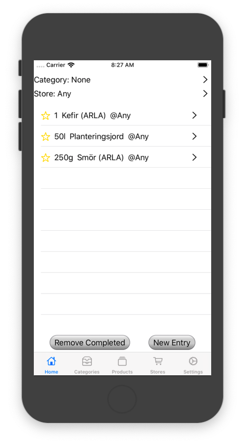  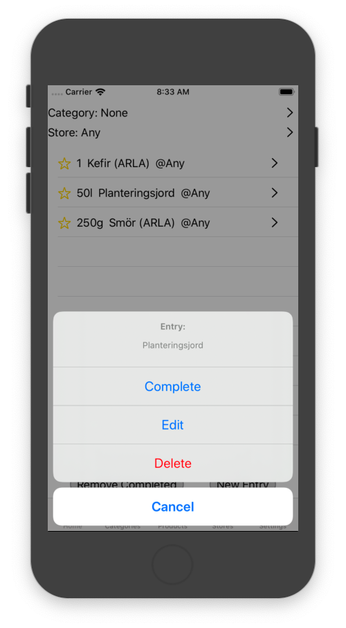 -> 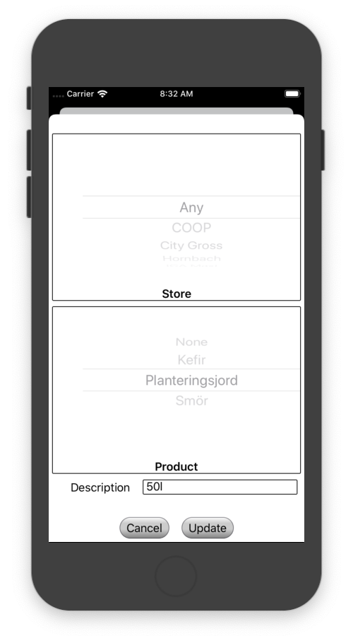

## Categories Tab
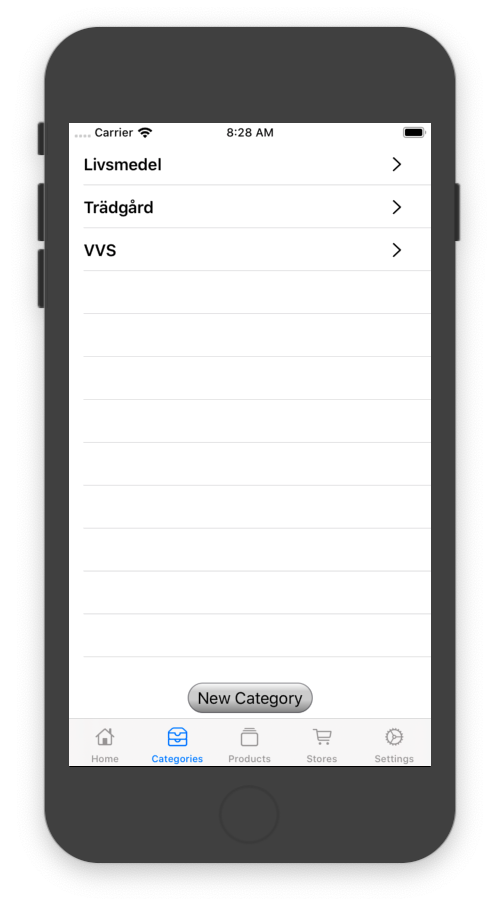 -> 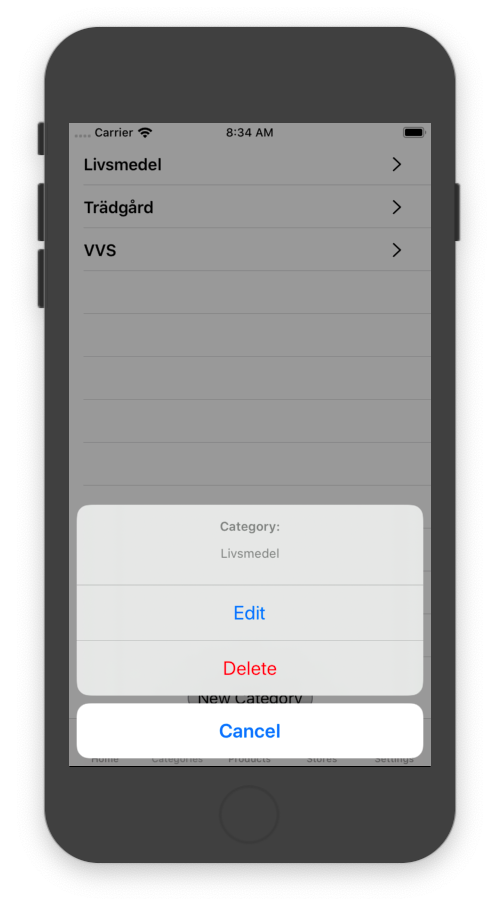 -> 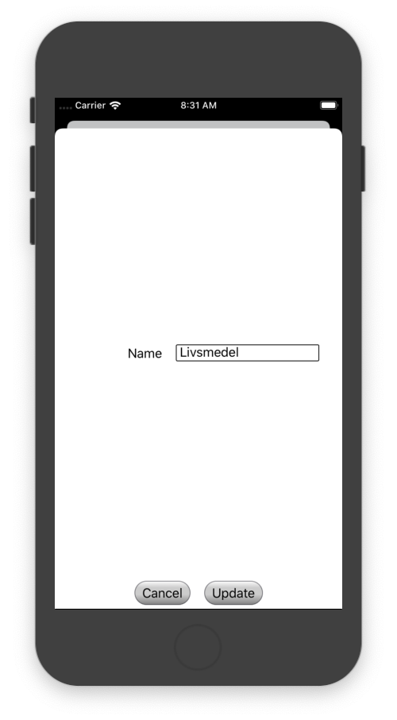

## Products Tab
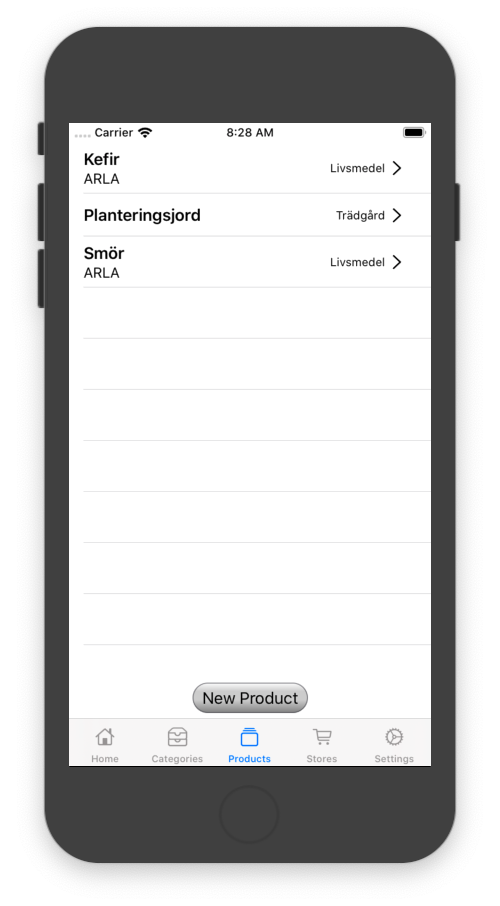 -> 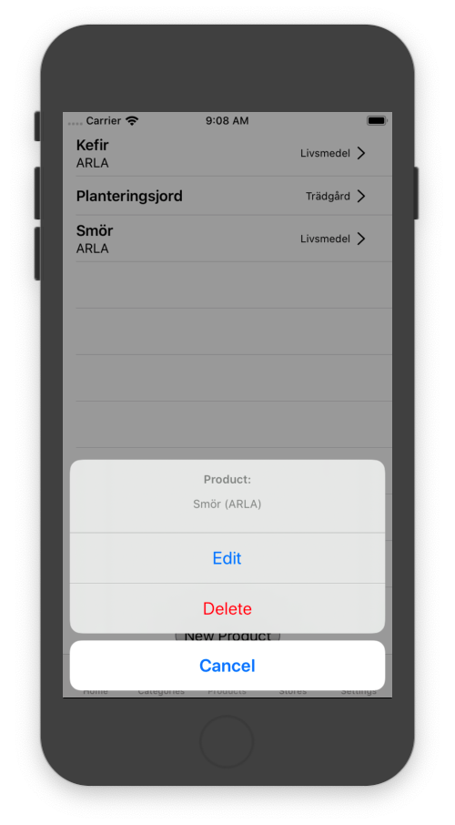 -> 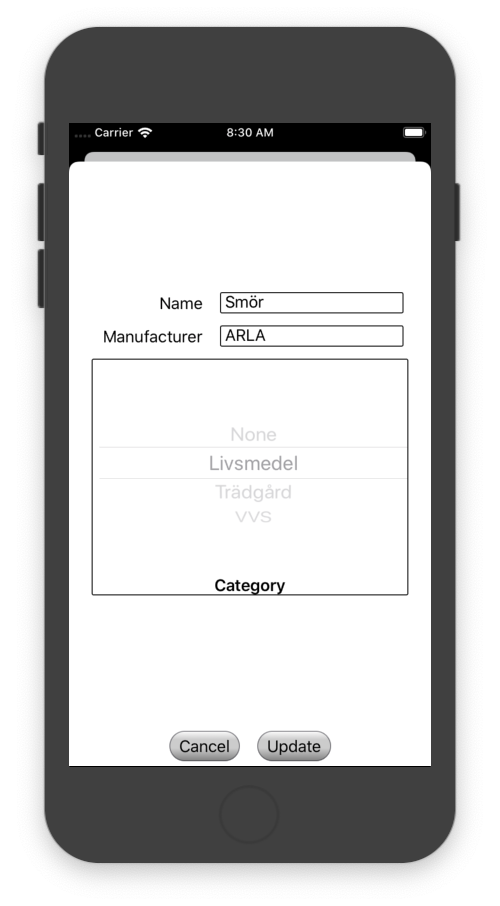

## Stores Tab
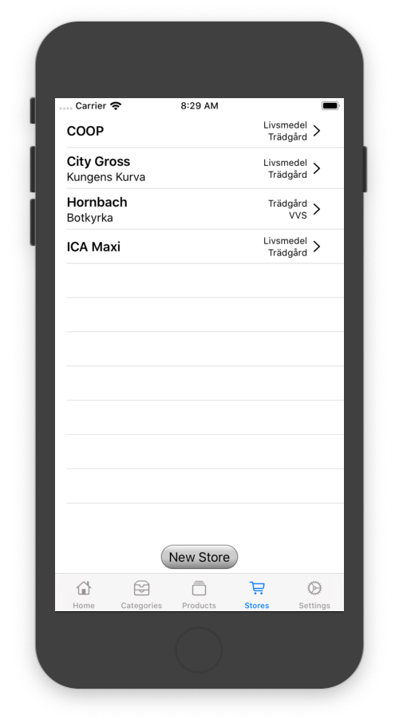 -> 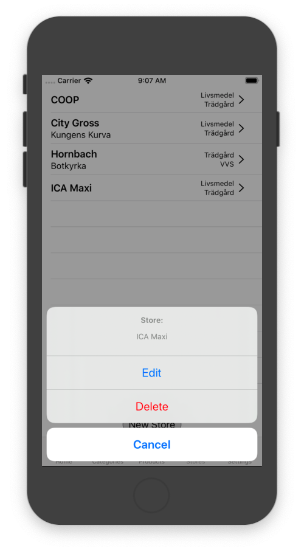 -> 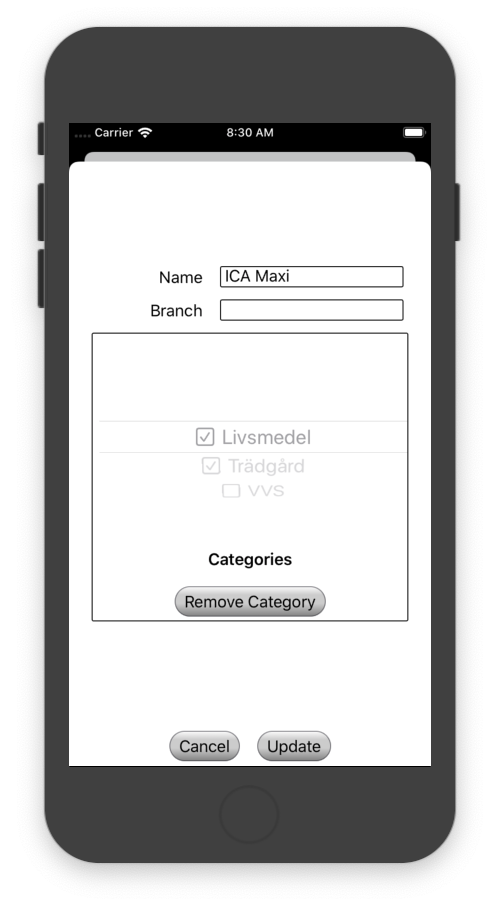

## Settings Tab

There are no settings as yet.

## Core Data Schema

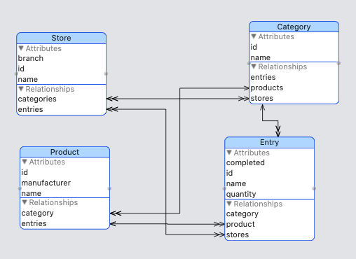

### Category
- Attributes
  - id
  - name
- Relationships
  - entries
  - products
  - stores

### Entry
- Attributes
  - completed
  - id
  - name (actually Product.name)
  - quantity
- Relationships
  - category
  - product
  - stores

### Product
- Attributes
  - id
  - manufacturer
  - name
- Relationships
  - category
  - entries

### Store
- Attributes
  - branch
  - id
  - name
- Relationships
  - category
  - entries
